# Container Base Image Evaluation
## Alpine vs Debian Slim for the same Python/Flask application

<div align="center">


**One application. Two base images. Same host. Measured instead of assumed.**

</div>

---

## Why I built this

I kept seeing **Alpine Linux and Docker mentioned together** and wanted to understand why by testing the relationship firsthand.

Instead of comparing marketing claims or isolated image sizes, I built the **same Flask application twice**:

- once on `python:3.13-alpine`
- once on `python:3.13-slim`

The application code, dependency file, exposed service, host machine, and test workflow stayed the same. The base image was the variable.

The goal was simple:

> **What does Alpine actually buy me as a container base image, and what does it not buy me?**

---

## Executive summary

The experiment produced a more useful answer than “Alpine is lighter.”

| Metric | Alpine | Debian Slim | Observation |
|---|---:|---:|---|
| Final image disk usage | **90.5 MB** | 197 MB | Alpine ~54% smaller |
| Final image content size | **22 MB** | 48.1 MB | Alpine ~54% smaller |
| Container filesystem | **64.5 MB** | 138 MB | Alpine ~53% smaller |
| Idle memory | 24.24 MiB | **22.05 MiB** | Debian used less RAM here |
| Build time, 3-run average | 33.83 s | **29.93 s** | Debian ~11.5% shorter |
| Steady start-to-ready | 1616.5 ms | **1478.5 ms** | Debian ~8.5% shorter |
| libc | musl 1.2.6 | glibc 2.41 | Different runtime ecosystems |
| Core userspace | BusyBox | GNU/coreutils | Different CLI behavior |

### The main result

**Alpine's clear advantage in this workload was storage footprint.**

It did **not** automatically provide lower idle RAM, faster builds, or faster application readiness.

That distinction became the most important lesson of the lab:

> **A smaller image is not the same thing as a faster or lower-memory application.**

---

## Experiment design

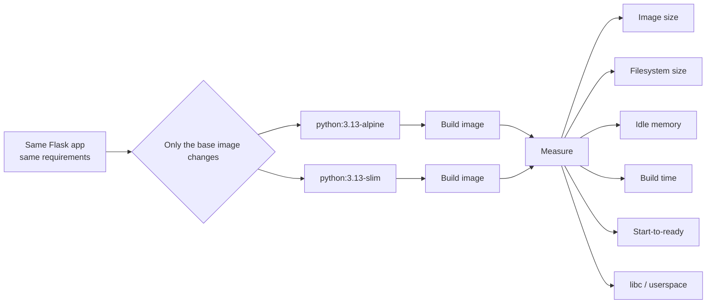

The application exposes two endpoints:

```text
GET /health  -> {"status":"ok"}
GET /info    -> system, architecture, Python version
```

Both images use the same application:

```python
import platform
from flask import Flask

app = Flask(__name__)

@app.route("/health")
def health():
    return {"status": "ok"}

@app.route("/info")
def info():
    return {
        "system": platform.system(),
        "architecture": platform.machine(),
        "python": platform.python_version(),
    }

if __name__ == "__main__":
    app.run(host="0.0.0.0", port=8080)
```

The Dockerfiles are intentionally almost identical.

### Alpine

```dockerfile
FROM python:3.13-alpine

WORKDIR /app

COPY app/requirements.txt .

RUN pip install --no-cache-dir -r requirements.txt

COPY app/app.py .

CMD ["python", "app.py"]
```

### Debian Slim

```dockerfile
FROM python:3.13-slim

WORKDIR /app

COPY app/requirements.txt .

RUN pip install --no-cache-dir -r requirements.txt

COPY app/app.py .

CMD ["python", "app.py"]
```

---

## Test environment

| Component | Value |
|---|---|
| Host OS | Linux Mint 22.3 “Zena” |
| Ubuntu base | Noble |
| Architecture | x86_64 / amd64 |
| Host kernel | `7.0.0-31-generic` |
| Docker Engine | 29.8.1 |
| Application runtime | Python 3.13 |
| Service | Flask on port 8080 |

A key container concept became visible during the test: **both containers report the host Linux kernel**. Changing the base image changes the userspace, package ecosystem, libc, and filesystem—not the kernel running underneath the container.

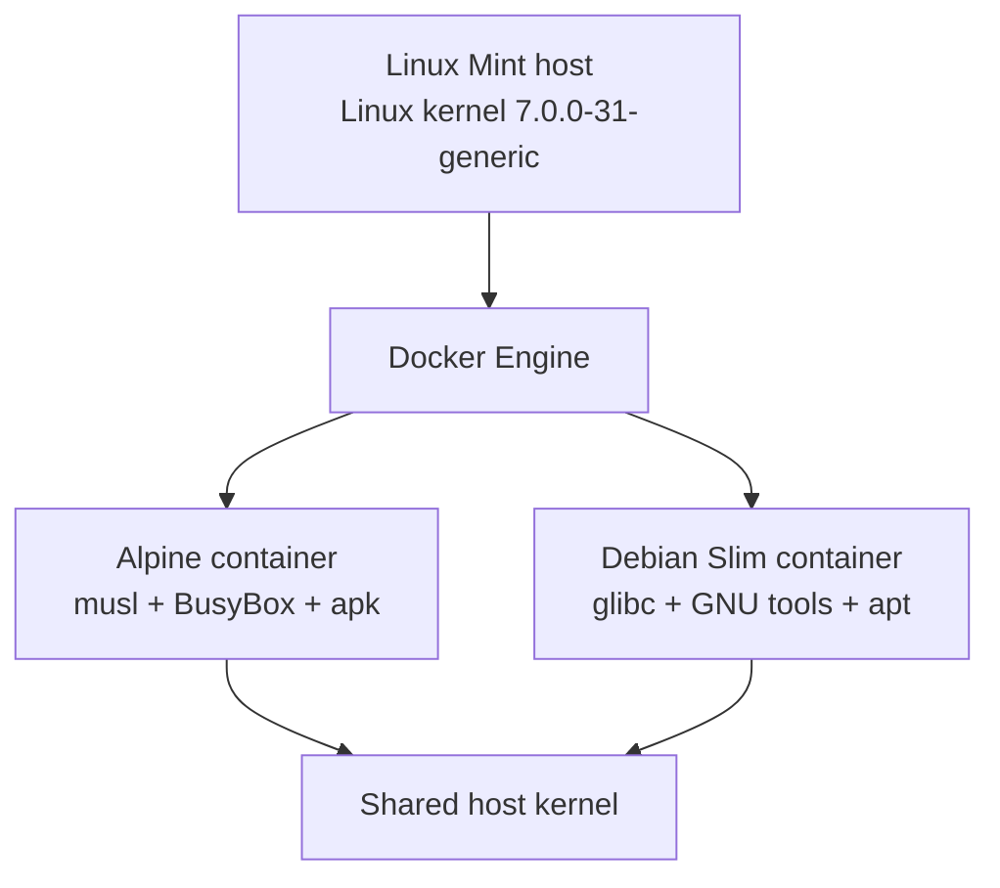

---

# Results

## 1. Bare base-image baseline

Before adding the Flask application, the underlying distributions already showed a large footprint difference.

| Metric | Alpine 3.24.2 | Debian bookworm-slim | Debian / Alpine |
|---|---:|---:|---:|
| Root filesystem | 8.7 MB | 82 MB | ~9.4× |
| Docker disk usage | 13 MB | 116 MB | ~8.9× |
| Content size | 3.94 MB | 30.6 MB | ~7.8× |

<table>
<tr>
<td width="50%">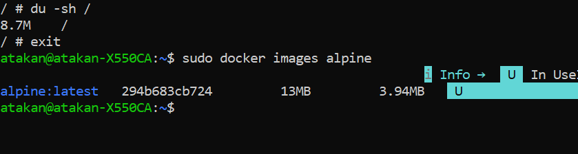</td>
<td width="50%">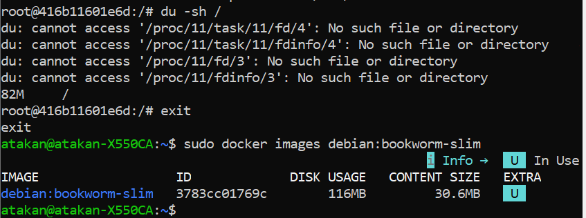</td>
</tr>
<tr>
<td align="center"><b>Alpine baseline</b></td>
<td align="center"><b>Debian Slim baseline</b></td>
</tr>
</table>

The bare images make Alpine's minimalism obvious. But that is not the whole application story.

---

## 2. Final application image size

After adding the **same Python runtime, Flask dependency, and application code**, the difference narrowed considerably.

| Metric | Alpine app image | Debian Slim app image | Debian / Alpine |
|---|---:|---:|---:|
| Docker disk usage | **90.5 MB** | 197 MB | ~2.18× |
| Content size | **22 MB** | 48.1 MB | ~2.19× |

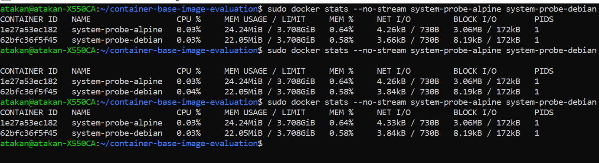

The ratio shrank from roughly **8–9× at the bare-image level to ~2.2× at the application-image level**.

That makes sense: once the same Python runtime and application payload are added to both images, they contribute substantial common weight.

An interesting detail is that the **absolute content-size difference remains about 26 MB**, very close to the original base-image content delta. Most of the final difference still comes from the base userspace.

---

## 3. Container filesystem size

Measured from inside the running containers using a one-filesystem `du`:

```bash
docker exec system-probe-alpine du -shx /
docker exec system-probe-debian du -shx /
```

| Alpine | Debian Slim |
|---:|---:|
| **64.5 MB** | 138 MB |

Debian's visible container filesystem was about **2.14× larger**.

This also exposed a practical tooling difference: a GNU-style `du --exclude=...` command failed on Alpine because its BusyBox implementation does not provide the same option set.

That was a useful reminder that “smaller userspace” also means **different command-line ergonomics and compatibility**.

---

## 4. Idle memory

Both containers were run at the same time and sampled with:

```bash
docker stats --no-stream
```

The readings remained stable across repeated snapshots.

| Container | Idle memory | CPU | PIDs |
|---|---:|---:|---:|
| Alpine | 24.24 MiB | ~0.03% | 1 |
| Debian Slim | **22.05 MiB** | ~0.03–0.04% | 1 |

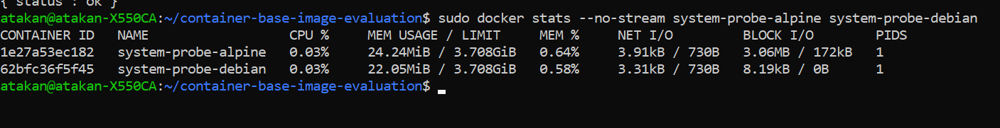

In this workload, Alpine used about **2.19 MiB more idle memory**, roughly **9.9% more**.

This is not a universal statement about Alpine. It is a result for this specific Python/Flask workload on this host.

What it does demonstrate is more important:

> **Image size and runtime memory are different dimensions.**

---

## 5. libc and userspace

The images differ substantially below the Python application layer.

### libc

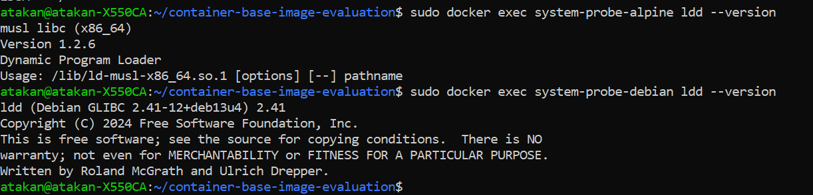

| Alpine | Debian Slim |
|---|---|
| musl libc 1.2.6 | glibc 2.41 |

### Core command-line userspace

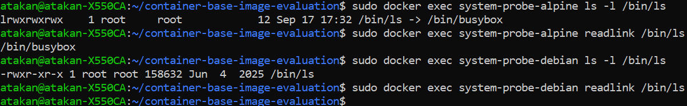

On Alpine:

```text
/bin/ls -> /bin/busybox
```

On Debian Slim, `/bin/ls` is a standalone executable.

This is one reason Alpine can remain so compact: BusyBox provides many common Unix commands through one multi-call binary.

It is also why scripts or debugging habits written with GNU-specific options can behave differently.

---

## 6. Package-manager footprint

The final containers contained:

| Alpine | Debian Slim |
|---:|---:|
| 29 `apk` package entries | 87 `dpkg` package entries |

Package counts are **not directly comparable size metrics** because distributions split and group packages differently. They are still useful as another indication of the different userspace philosophies.

Package managers:

```text
Alpine      -> apk
Debian Slim -> apt / dpkg
```

---

## 7. Build-time benchmark

The build benchmark intentionally disabled application-layer caching while keeping the base images already available locally.

Method:

```text
warm base image + --no-cache application build
```

This is **not** a cold internet-pull benchmark.

### Raw measurements

| Run | Alpine | Debian Slim |
|---:|---:|---:|
| 1 | 38.54 s | 30.21 s |
| 2 | 31.73 s | 31.21 s |
| 3 | 31.22 s | 28.36 s |
| **Average** | **33.83 s** | **29.93 s** |

Debian Slim's average was about **3.90 seconds shorter**, or roughly **11.5%** relative to Alpine's average.

<table>
<tr>
<td width="50%">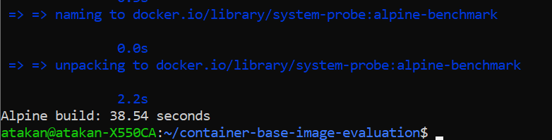</td>
<td width="50%">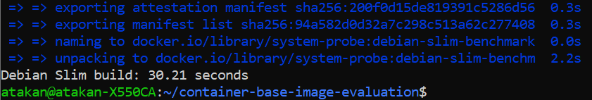</td>
</tr>
<tr>
<td align="center"><b>Alpine build sample</b></td>
<td align="center"><b>Debian Slim build sample</b></td>
</tr>
</table>

Alpine's first run was noticeably slower than its next two, so this result should be treated as a small local benchmark—not a universal build-speed ranking.

---

## 8. Start-to-ready benchmark

A first attempt measured:

```text
docker run -> container creation -> process startup -> HTTP readiness
```

That produced inconsistent results because container creation and lifecycle overhead were mixed into application readiness.

A separate lifecycle test made the problem obvious:

```text
Alpine docker run --rm + Python print + exit
3.84 s
3.85 s
4.05 s
```

So the benchmark was redesigned.

### Improved method

Containers were created **before** timing:

```bash
docker create ...
```

Then the timer measured:

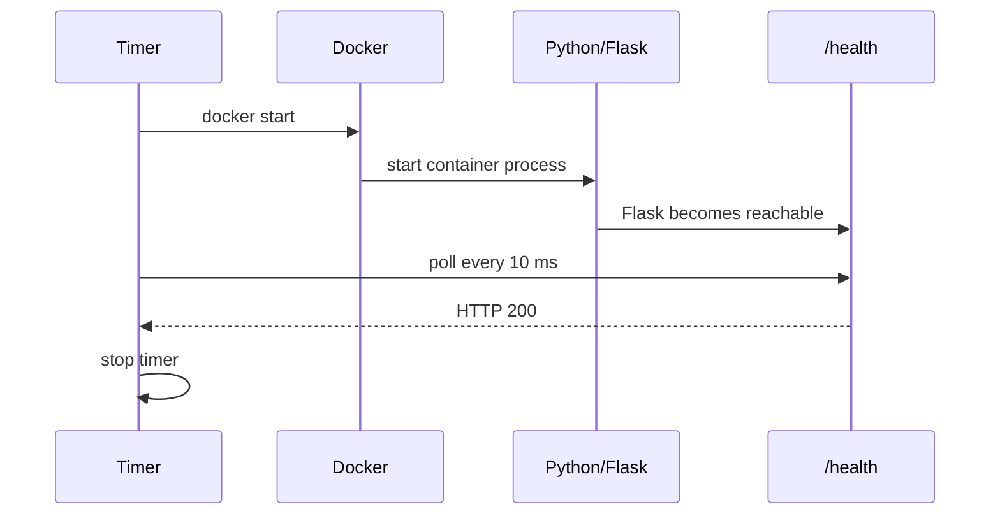

This gives a cleaner metric:

> **pre-created stopped container → HTTP 200 from `/health`**

### Matched five-run series

| Run | Alpine | Debian Slim |
|---:|---:|---:|
| 1 | 2169 ms | 3632 ms |
| 2 | 1583 ms | 1488 ms |
| 3 | 1612 ms | 1480 ms |
| 4 | 1605 ms | 1471 ms |
| 5 | 1666 ms | 1475 ms |
| **Average** | **1727 ms** | **1909 ms** |
| **Median** | **1612 ms** | **1480 ms** |
| **Min** | **1583 ms** | **1471 ms** |
| **Max** | **2169 ms** | **3632 ms** |

An earlier exploratory Alpine measurement of **1730 ms** was also valid, but it was kept outside the matched five-run comparison.

The first run on each side was slower—dramatically so for Debian Slim. Looking at the four subsequent starts gives a more stable repeated-start picture:

| | Alpine | Debian Slim |
|---|---:|---:|
| Runs 2–5 average | 1616.5 ms | **1478.5 ms** |

Debian Slim was about **8.5% shorter** in this repeated-start subset.

Again, this is a result for this machine and workload. The useful lesson is not “Debian starts faster.” The useful lesson is that **Alpine's smaller image did not translate into a readiness advantage here**.

---

# What changed as the experiment progressed

One of the most useful parts of this lab was that the benchmark methodology itself had to be corrected.

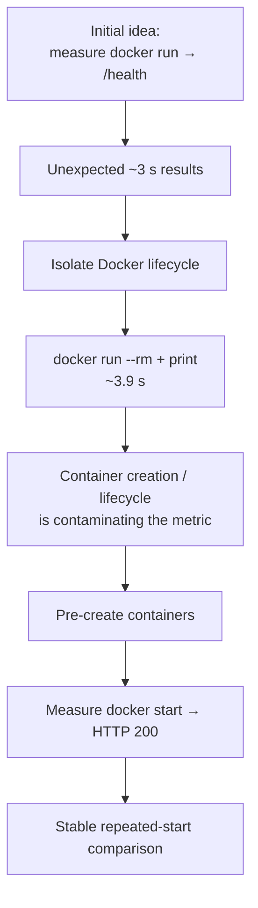

That investigation mattered more than simply collecting another number.

A benchmark can look precise while measuring more than intended.

---

# What I learned

### 1. Alpine's strongest result was storage efficiency

The final application image remained about **54% smaller** by both Docker disk usage and content size.

### 2. Base-image ratios shrink once a real application is added

The bare-image gap was around **8–9×**. After adding Python and Flask, the final gap was around **2.2×**.

The application payload dilutes the relative importance of the base image.

### 3. Smaller image does not imply lower RAM

Alpine was smaller on disk but used slightly more idle memory in this workload.

### 4. Smaller image does not imply faster startup

Repeated start-to-ready measurements did not show an Alpine advantage.

### 5. Smaller image does not imply faster builds

Debian Slim built slightly faster in these warm-base, no-cache tests.

### 6. Alpine changes the userspace, not the kernel

Both containers ran on the host kernel. Alpine's identity came from its compact userspace: musl, BusyBox, apk, and its filesystem/package composition.

### 7. Minimalism has operational consequences

BusyBox's reduced command options were not theoretical—I hit one during the experiment.

That makes base-image choice partly a question of **debugging ergonomics, script compatibility, dependency compatibility, and operational expectations**, not just megabytes.

---

# Conclusion

I started this lab because Alpine and Docker are so often mentioned together that it was easy to mentally compress the relationship into:

> “Alpine is tiny, therefore Alpine containers are better.”

The experiment replaced that shortcut with a more precise model.

**For this Python/Flask application:**

- Alpine produced a substantially smaller image and filesystem.
- Debian Slim used slightly less idle memory.
- Debian Slim built somewhat faster in the measured runs.
- Debian Slim also had slightly shorter repeated start-to-ready times.
- Alpine used musl + BusyBox; Debian Slim used glibc + a more conventional GNU userspace.

So the practical question is not:

> “Which base image is best?”

It is:

> **“Which trade-offs matter for this application?”**

If storage footprint and minimal userspace are important, Alpine is compelling.

If compatibility, familiar tooling, or glibc-based dependencies matter more, Debian Slim may be the simpler choice.

The key outcome of the lab is that the choice can now be made from **measured trade-offs instead of association or habit**.

---

# Repository structure

```text
container-base-image-evaluation/
├── app/
│   ├── app.py
│   └── requirements.txt
├── alpine/
│   └── Dockerfile
├── debian-slim/
│   └── Dockerfile
├── results/
│   ├── benchmark-results.md
│   └── benchmark-results.csv
└── assets/
    ├── alpine-baseline.png
    ├── alpine-build-time.png
    ├── application-image-size-comparison.png
    ├── busybox-vs-debian-userspace.png
    ├── debian-baseline.png
    ├── debian-slim-build-time.png
    ├── idle-memory-comparison.png
    └── libc-comparison.png
```

---

# Reproducing the core experiment

Build both images from the repository root:

```bash
docker build -f alpine/Dockerfile -t system-probe:alpine .
docker build -f debian-slim/Dockerfile -t system-probe:debian-slim .
```

Run them:

```bash
docker run -d --name system-probe-alpine -p 8081:8080 system-probe:alpine
docker run -d --name system-probe-debian -p 8082:8080 system-probe:debian-slim
```

Validate:

```bash
curl http://localhost:8081/health
curl http://localhost:8082/health

curl http://localhost:8081/info
curl http://localhost:8082/info
```

Compare runtime memory:

```bash
docker stats --no-stream system-probe-alpine system-probe-debian
```

Inspect libc:

```bash
docker exec system-probe-alpine ldd --version
docker exec system-probe-debian ldd --version
```

Inspect userspace:

```bash
docker exec system-probe-alpine ls -l /bin/ls
docker exec system-probe-alpine readlink /bin/ls

docker exec system-probe-debian ls -l /bin/ls
docker exec system-probe-debian readlink /bin/ls
```

---

## Scope and limitations

This is a **single-host, single-application learning benchmark**, not a general performance study.

Results are influenced by:

- host hardware and storage
- Docker state and caching
- Python image revisions
- Alpine and Debian release revisions
- local system load
- the simplicity of the Flask workload
- small sample sizes

The measurements are useful because they answer a concrete local question under controlled conditions. They should not be generalized into universal distro rankings.

---

<div align="center">

**Measured on real hardware. Documented as a learning lab.**

</div>
