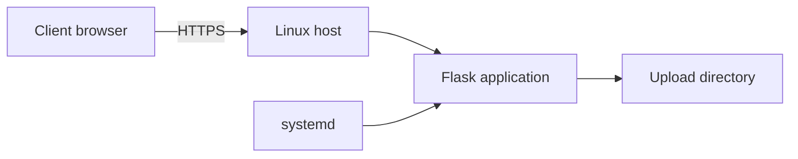
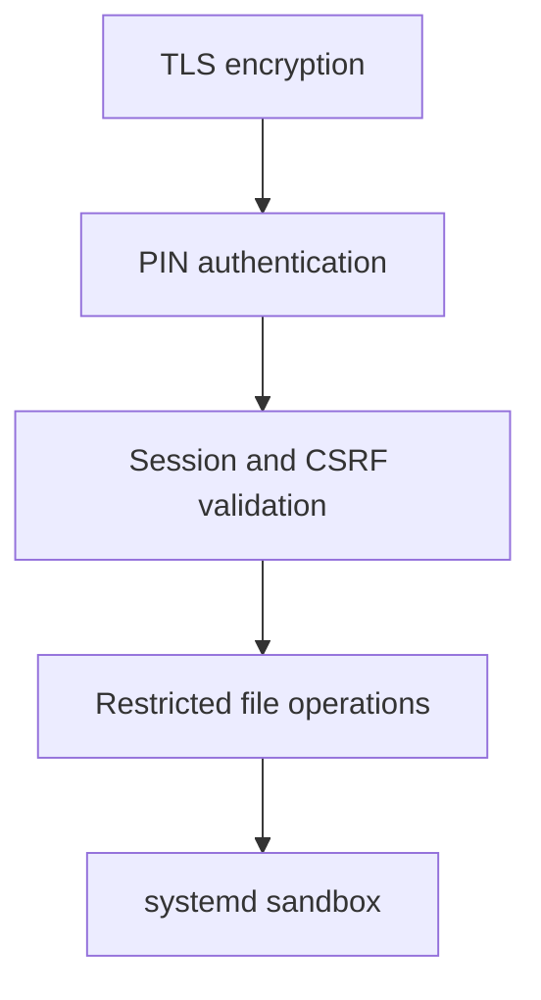

# LAN Drop


[](https://github.com/atakankeskin99/linux-lab/actions/workflows/lan-drop-security-tests.yml)

A lightweight, browser-based file transfer service for trusted local networks.

LAN Drop turns a Linux machine into an on-demand HTTPS file server with PIN authentication, multi-file upload, download, deletion, and systemd-managed operation. It can run on an existing local network or create its own Wi-Fi access point.

<p align="center">
  
</p>

<p align="center">
  <em>No dedicated client application is required—only a web browser.</em>
</p>

> [!WARNING]
> **Read before installing**
>
> LAN Drop is a learning project intended for temporary file transfers between trusted devices on trusted local networks. Its security controls and regression tests do not guarantee protection against every vulnerability, data loss, or system compromise.
>
> * **Restrict network access.** Do not expose TCP 8080 to the Internet through port forwarding, public tunnels, or a public reverse proxy. The service listens on all IPv4 interfaces; use firewall rules to restrict access to the intended trusted network. Avoid public or shared untrusted networks.
> * **The PIN grants shared access.** Anyone who can reach the service and authenticate with the PIN can list, upload, download, and delete files in the shared upload directory. There are no individual accounts or per-user file permissions. Avoid sensitive files and keep separate backups of anything important.
> * **Uploaded files are not scanned for malware.** Only open files from sources you trust. HTTPS protects data in transit; it does not make a transferred file safe to open or execute.
> * **The upload limit is not a storage quota.** The 100 MiB limit applies to each request. Repeated uploads can still fill the host's disk; monitor available space and remove unneeded files.
> * **Installing a CA certificate changes client trust.** Only trust the public CA certificate obtained from your own trusted host. A compromised CA private key could be used to issue certificates accepted by clients that trust this CA. Never share private keys, and remove the CA from client trust stores when it is no longer needed.
> * **Installation changes the host system.** Review the scripts before running them with `sudo`. The V1 installer installs dependencies, creates a service account, and starts the network service immediately. Stop LAN Drop after transfers are complete.
>
> Read the [security model and known limitation](#security-model) and the [installation and client trust guide](docs/03-installation.md) before proceeding.

---

## Why this project exists

LAN Drop began as a simple way to move files between devices on the same network.

It evolved into a practical Linux lab covering:

* Flask application development
* HTTPS and local certificate trust
* Authentication and session handling
* CSRF and upload security
* systemd service management and sandboxing
* Wi-Fi access-point operation
* Runtime security testing and regression verification

The result is intentionally small in scope but implemented across several layers of the Linux and networking stack.

---

## Quick start — V1 existing LAN

The installer currently supports Ubuntu 24.04 and Linux Mint 22:

```bash
git clone https://github.com/atakankeskin99/linux-lab.git
cd linux-lab/projects/lan-drop
chmod +x install.sh uninstall.sh scripts/doctor.sh
sudo ./install.sh
```

Choose a six-digit PIN when prompted, then open one of the HTTPS URLs printed by the installer.

LAN Drop creates its own local certificate authority. After reviewing the trust implications above and verifying that the certificate comes from your host, install the generated **public CA certificate** on each client:

```text
/var/lib/lan-drop/lan-drop-ca.crt
```

Do not bypass browser certificate warnings without verifying the certificate and endpoint.

[Read the complete installation, client trust, verification, and uninstall guide](docs/03-installation.md)

> LAN Drop is intended for trusted local networks. Do not expose TCP 8080 directly to the Internet.

---

## Optional V2 hotspot

After installing V1, a supported Wi-Fi adapter can provide a dedicated `LAN-Drop` network:

```bash
chmod +x install-v2.sh uninstall-v2.sh scripts/doctor-v2.sh
sudo ./install-v2.sh
sudo lan-drop start
```

Clients connect to the `LAN-Drop` SSID and open:

```text
https://10.42.0.1:8080
```

[Read the complete V2 installation, verification, and removal guide](docs/04-v2-installation.md)

> On a single-adapter host, starting V2 replaces the current Wi-Fi connection and may disconnect SSH or Tailscale.

---

## Features

### File transfer

* Browser-based interface
* Multi-file upload
* File listing, download, and deletion
* Duplicate filename preservation
* Filename sanitization
* 100 MiB request-size limit

### Security

* 6-digit PIN authentication
* Session-based access control
* PIN attempt throttling
* Session-bound CSRF tokens
* HTTPS with locally trusted certificates
* Secrets kept outside application source
* Restricted filesystem access
* Hardened systemd process sandbox

### Linux and networking

* On-demand systemd service
* Existing-LAN operation
* Optional self-hosted Wi-Fi network
* NetworkManager hotspot coordination
* SSH administration
* Bash lifecycle wrapper for V2

---

## How it works



The browser acts as the client interface. Requests pass through TLS, PIN authentication, session validation, and CSRF validation before reaching file operations.

LAN Drop is designed for temporary use on a trusted local network rather than permanent public exposure.

---

## Operating modes

| Mode                         | Network source                          | Best suited for                   | Trade-off                                      |
| ---------------------------- | --------------------------------------- | --------------------------------- | ---------------------------------------------- |
| **V1 — Existing LAN**        | Existing router or local network        | Normal day-to-day use             | Requires both devices to share a network       |
| **V2 — Self-hosted network** | Linux host creates a Wi-Fi access point | Router-free transfers             | Clients must temporarily switch Wi-Fi networks |

### V1 — Existing LAN

The Linux host and client connect to the same existing network. The client opens LAN Drop in a browser and transfers files without changing networks.

This is the preferred operating mode because it offers the simplest user experience.

[Read the V1 implementation and setup documentation](docs/01-lan-drop.md)

### V2 — Self-hosted network

The Linux Wi-Fi adapter switches into access-point mode and creates a dedicated `LAN-Drop` network. The host provides both the network and the application.

This removes the need for an existing router or Internet connection, but clients must leave their current Wi-Fi network during the transfer.

A dedicated hotspot does not by itself guarantee isolation from the host's other networks. The same trust and access restrictions apply in both modes.

[Read the V2 access-point experiment](docs/01.1-lan-drop-v2.md)

---

## Security model

LAN Drop applies controls at multiple layers:



Key controls include:

* Five failed PIN attempts trigger a 60-second IP-based lockout
* State-changing requests require a valid session-bound CSRF token
* Oversized requests are rejected before files are persisted
* Duplicate uploads receive numbered filenames instead of overwriting existing files
* Uploaded filenames are sanitized before filesystem use
* TLS certificates include the active endpoint as a Subject Alternative Name
* The service's persistent application data writes are restricted to its designated upload directory by the supplied systemd configuration

This is defense in depth for a local utility—not a claim that LAN Drop is suitable for direct Internet exposure or hostile multi-user environments.

### Known limitation — CA private-key permissions

The current V1 installer assigns `/etc/lan-drop/tls/ca.key` to `root:lan-drop` with mode `0640`. This allows the application service account to read the CA private key, although serving HTTPS requires only the server certificate and server private key.

If an attacker gained arbitrary code execution as the service account, this access could expose the CA private key. Certificates issued using that key could be accepted by clients that trust the LAN Drop CA.

The CA private key should be readable only by root and kept inaccessible to the application service account. This README documents the limitation; it does not change the installer or repair existing installations.

---

## Security hardening results

The project was tested against the running service rather than reviewed only at source level.

| Area              | Initial observation                            | Remediation                               |
| ----------------- | ---------------------------------------------- | ----------------------------------------- |
| PIN guessing      | Repeated attempts were unrestricted            | 5-attempt / 60-second lockout              |
| CSRF              | No explicit application-level token validation | Session-bound CSRF tokens                 |
| Upload size       | No verified request boundary                   | 100 MiB request limit                     |
| Duplicate uploads | Existing files could be replaced               | Automatic `_1`, `_2`, … preservation       |
| TLS identity      | Certificate contained an outdated LAN IP       | SAN-correct certificate generated         |
| systemd isolation | `9.2 UNSAFE` exposure score                     | Hardened to `4.4 OKAY`                     |
| Path traversal    | Escape attempts required verification          | No escape observed during runtime testing |

<p align="center">
  
</p>

<p align="center">
  <em>Measured with systemd-analyze before and after service hardening.</em>
</p>

The systemd exposure score evaluates service sandbox settings. It is not an overall application security rating or proof that vulnerabilities are absent.

[Read the complete security review and verification process](docs/02-security-hardening.md)

---

## Executable security evidence

The repository includes an automated security regression suite for controls that can be verified without a configured systemd host or trusted local certificate:

```bash
cd projects/lan-drop
python -m pip install -r requirements.txt
python -m unittest discover -s tests -v
```

The suite verifies that:

* unauthenticated uploads are redirected to login
* a correct PIN creates an authenticated session and CSRF token
* authenticated uploads without a valid CSRF token fail with HTTP 403 and do not write a file
* a valid CSRF token permits an upload while a traversal-style filename is sanitized
* duplicate filenames are preserved with a numbered suffix instead of overwriting the original
* oversized uploads return HTTP 413 without writing a file
* the upload, download, and CSRF-protected delete lifecycle preserves file integrity
* the PIN lockout remains active after five failed attempts

The same command runs in GitHub Actions for changes affecting LAN Drop. Host-level claims—TLS identity, network exposure, and systemd sandboxing—remain documented runtime observations because they depend on the deployed machine.

These tests cover specific behaviors; they do not constitute a comprehensive security audit.

[Inspect the executable security tests](tests/test_security.py)

---

## Verified behavior

The final regression cycle confirmed:

* Service startup under the hardened systemd configuration
* Certificate trust and SAN validation without bypassing TLS checks
* Rejection of unauthenticated requests
* PIN rate limiting and lockout
* CSRF rejection with HTTP 403
* Normal and multi-file uploads
* Duplicate filename preservation
* Downloaded file integrity
* CSRF-protected deletion
* Rejection of a 101 MiB upload with HTTP 413
* No oversized file persisted to disk
* Continued application operation under the systemd sandbox

<p align="center">
  
</p>

---

## Service lifecycle

On a configured host, LAN Drop is controlled through systemd:

```bash
sudo systemctl start lan-drop
systemctl status lan-drop --no-pager
sudo systemctl restart lan-drop
sudo systemctl stop lan-drop
```

The service is intentionally disabled at boot. The V1 installer starts it immediately after installation; stop it when transfers are complete. LAN Drop is an on-demand utility, not permanent infrastructure.

Because systemd owns the process, an SSH session used to start or inspect the service does not need to remain open.

---

## V2 launcher

V2 includes a Bash wrapper that coordinates the Wi-Fi hotspot and application service:

```bash
sudo lan-drop start
sudo lan-drop status
sudo lan-drop stop
```

The launcher is available at [`scripts/lan-drop`](scripts/lan-drop).

Network lifecycle and application lifecycle remain separate: the Flask application does not need to know whether connectivity comes from an existing router or the Linux host itself.

---

## Project structure

```text
lan-drop/
├── README.md
├── app.py
├── install.sh
├── install-v2.sh
├── requirements.txt
├── uninstall.sh
├── uninstall-v2.sh
├── assets/
│   ├── lan-drop-ui.png
│   ├── duplicate-filename-protection.png
│   ├── security-regression-summary.png
│   └── systemd-security-hardening.png
├── docs/
│   ├── 01-lan-drop.md
│   ├── 01.1-lan-drop-v2.md
│   ├── 02-security-hardening.md
│   ├── 03-installation.md
│   └── 04-v2-installation.md
├── scripts/
│   ├── doctor.sh
│   ├── doctor-v2.sh
│   └── lan-drop
└── systemd/
    └── lan-drop.service
```

---

## Documentation

* [LAN Drop V1 — application and local-network service](docs/01-lan-drop.md)
* [LAN Drop V2 — self-hosted Wi-Fi mode](docs/01.1-lan-drop-v2.md)
* [Security review, hardening, and regression testing](docs/02-security-hardening.md)
* [Installation and client CA trust](docs/03-installation.md)
* [V2 hotspot installation and operation](docs/04-v2-installation.md)

---

## Key engineering lessons

LAN Drop demonstrates that even a small utility crosses several engineering boundaries:

* A working service is not necessarily a tested service
* Authentication and CSRF protection address different threats
* TLS trust and TLS endpoint identity are separate requirements
* Least privilege must be verified without breaking required behavior
* Greater infrastructure independence can reduce usability
* Security changes require regression testing after remediation

V1 showed how a small Flask application could become reusable local infrastructure. V2 explored whether the same host could provide its own network. The security review then tested the assumptions made by both the application and its Linux service environment.