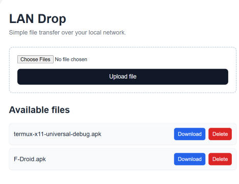

# 01 — LAN Drop

LAN Drop began as a small, learning-focused local-network file-transfer service hosted on a Linux Mint XFCE laptop.

The original goal was simple: move files between devices on the same LAN without relying on cloud storage, messaging apps, or cables. What started as a small Flask experiment gradually became a reusable internal service for the lab.

## What it became

LAN Drop currently supports:

- browser-based file upload
- multiple-file uploads in a single request
- file listing
- file download
- file deletion
- 6-digit PIN access
- session-based authentication
- HTTPS/TLS with locally generated certificates using `mkcert`
- manual lifecycle management with `systemd`
- SSH administration from another machine on the LAN
- access from Windows, iPhone/iOS, Android-based devices, and other clients on the same local network

The service is intentionally **not enabled at boot**. It runs only when started manually.

## Architecture

```text
                            LOCAL NETWORK
                                  │
              ┌───────────────────┼───────────────────┐
              │                   │                   │
         Windows PC          Apple iPhone        OMIX X600
              │                   │                   │
              └───────────────────┼───────────────────┘
                                  │
                             Wi-Fi / LAN
                                  │
                              HTTPS / TLS
                                  │
                                  ▼
                         Linux Mint laptop
                            192.0.2.10
                                  │
                         lan-drop.service
                              systemd
                                  │
                                  ▼
                             Flask app
                                  │
                   ┌──────────────┼──────────────┐
                   │              │              │
                Upload         Download        Delete
                   │              │              │
                   └────── Linux filesystem ─────┘
```

`192.0.2.10` is used here as a documentation-only example address.

The Linux laptop acts as the host. Windows, iOS, Android, and other devices on the LAN act as clients through a web browser.

<p align="center">
  
</p>

<p align="center">
  <em>LAN Drop web interface for local file transfer.</em>
</p>

## Request flow

```text
Client browser
      │
      ▼
https://192.0.2.10:8080
      │
      ▼
TLS connection
      │
      ▼
PIN / session authentication
      │
      ▼
Flask
      │
      ▼
Linux filesystem
```

## HTTPS and local certificate trust

LAN Drop originally ran over plain HTTP. HTTPS was later added using `mkcert`.

A local certificate authority was created on the Linux host, and that CA signed a certificate for the LAN Drop service.

```text
mkcert Local CA
      │
      │ signs
      ▼
LAN Drop certificate
      │
      ▼
192.0.2.10:8080
```

The certificate setup covered the LAN service address together with local hostnames such as:

```text
192.0.2.10
localhost
127.0.0.1
```

The local CA certificate was imported into the trusted root store of the Windows client, allowing the browser to validate LAN Drop normally over HTTPS.

The iPhone can also connect over HTTPS. On devices where the local CA has not been installed as a trusted root, the browser may still display a certificate warning.

This part of the project made the relationship between **encryption, certificate identity, and certificate trust** much more concrete.

## PIN and session access

LAN Drop uses a simple 6-digit PIN gate before exposing the file interface.

The PIN and Flask session secret are not hard-coded into the application. They are supplied through an external environment file used by the systemd service.

This keeps application code and runtime configuration separate:

```text
app.py
  │
  ├── application logic
  │
systemd service
  │
  ├── process lifecycle
  │
environment file
  │
  └── PIN / session secret
```

No real PINs or secrets are stored in this repository.

## Multiple-file upload

The first version accepted one file per request.

The frontend originally used:

```html
<input type="file" name="file" required>
```

It was later extended to:

```html
<input type="file" name="file" multiple required>
```

The Flask backend changed from handling one file:

```python
file = request.files["file"]
```

to handling the complete list:

```python
files = request.files.getlist("file")

for file in files:
    ...
```

This allowed multiple images, PDFs, and other files to be selected and uploaded in a single operation.

## Linux service management

LAN Drop is registered with systemd as:

```text
lan-drop.service
```

The Flask application therefore runs independently from the SSH session used to administer the Linux host.

The service is deliberately kept **disabled** so it does not start automatically when Linux boots.

Typical lifecycle:

```bash
sudo systemctl start lan-drop

systemctl status lan-drop --no-pager

sudo systemctl restart lan-drop

sudo systemctl stop lan-drop
```

This provides a practical manual workflow: start the service when file transfer is needed, then stop it afterwards.

## Remote administration

The Linux host can be managed remotely over SSH from another machine on the same LAN:

```bash
ssh <user>@192.0.2.10
```

Because systemd manages the application process, the SSH session can be closed after starting LAN Drop:

```bash
sudo systemctl start lan-drop
exit
```

LAN Drop continues running until explicitly stopped.

## Why LAN Drop matters to the X600 story

LAN Drop unexpectedly became deployment infrastructure.

When Termux and Termux:X11 APKs were needed for the OMIX X600, the files were downloaded on the PC, uploaded to LAN Drop, and then pulled from the phone browser.

```text
Windows PC
    │
    │ download APK
    ▼
LAN Drop
    │
    │ local transfer
    ▼
OMIX X600
```

A project originally created simply to make local file transfer easier directly enabled the next project.

That became one of the first important lessons of the lab:

> **Small internal tools can become useful infrastructure later.**

## What I learned

LAN Drop provided hands-on experience with:

- LAN addressing and private IPv4 concepts
- DHCP address changes
- listening network services
- HTTP request handling
- multipart form uploads
- frontend/backend interaction
- Flask routing
- Python virtual environments
- Linux filesystem operations
- SSH administration
- environment variables
- session-based authentication
- TLS and HTTPS
- certificates and certificate authorities
- local certificate trust stores
- `mkcert`
- Linux service lifecycle management
- `systemd`
- debugging connectivity across multiple layers

One particularly useful debugging model was separating a connection problem into layers instead of treating “the site does not open” as one issue:

```text
Application
    ↑
HTTP
    ↑
TLS
    ↑
TCP
    ↑
IP / LAN
```

## Security considerations

LAN Drop is a learning-focused service intended for use on a trusted local network.

Current protections include:

- HTTPS/TLS for encrypted transport
- 6-digit PIN access
- session-based authentication
- filename sanitization with Werkzeug
- service secrets stored outside the application code

Areas intentionally left for future experiments include:

- PIN attempt throttling / rate limiting
- upload size limits
- file-count limits
- file-type validation
- stronger session policy
- installing the local CA on additional client devices
- CSRF protection for destructive actions such as delete

These are useful next steps because they extend the project without changing its core purpose as a small local-network learning tool.

## Project evolution

```text
simple Flask app
       │
       ▼
LAN file upload
       │
       ▼
download + delete
       │
       ▼
PIN authentication
       │
       ▼
multiple-file upload
       │
       ▼
HTTPS / local CA
       │
       ▼
systemd service
       │
       ▼
reusable lab infrastructure
```

## Connection to the rest of the repo

LAN Drop is not just a separate side project in this story. It is the point where the lab started developing a reusable workflow:

```text
build a tool
   ↓
use the tool
   ↓
discover a new problem
   ↓
reuse the existing tool
   ↓
extend the lab
```

The project remains intentionally small, but it now connects several parts of the lab: the Linux host, the Windows workstation, the OMIX X600, and Apple/iOS clients.

Screenshots and visual documentation will be added later.