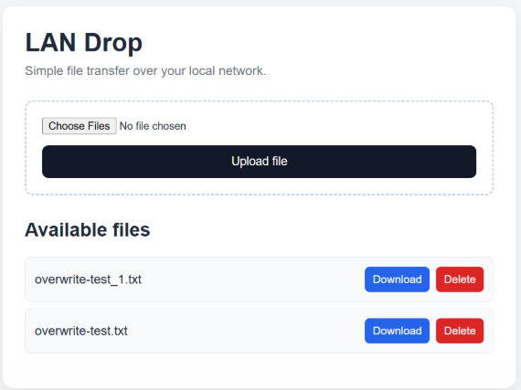

# 02 — LAN Drop Security Review and Hardening

LAN Drop began as a small local-network file-transfer service.

As the project accumulated authentication, HTTPS, file deletion, remote access, VPN interfaces, and systemd integration, the security assumptions around the application became more interesting than the original file-transfer problem itself.

This document records a hands-on security review of the running LAN Drop service and the hardening work that followed.

The goal was not to produce a formal penetration test.

The goal was to answer a simpler set of engineering questions:

> What can reach the service?

> Which operations require authentication?

> What happens when malformed or unwanted requests are sent?

> What assumptions are being made by the browser, Flask, Werkzeug, TLS, and systemd?

> Can those assumptions be tested rather than guessed?

The review therefore combined:

- source inspection
- live HTTP requests
- browser testing
- filesystem verification
- TLS inspection
- network-interface testing
- systemd analysis
- regression testing after remediation

The process followed a recurring pattern:

```text
inspect
   │
   ▼
test
   │
   ▼
observe
   │
   ▼
remediate
   │
   ▼
test again
```

---

# Scope

The review focused on the running LAN Drop service and the surrounding Linux service configuration.

The main areas were:

```text
Attack surface
Trust model
Authentication
CSRF
File handling
Network exposure
TLS
Abuse resistance
Service privileges
Logging
Regression behavior
```

The application was running as a Flask service on:

```text
TCP 8080
```

over HTTPS.

At the time of the review, the active LAN address of the Linux host was:

```text
192.168.1.109
```

Other active IPv4 interfaces included:

```text
127.0.0.1       loopback
192.168.1.109   local Wi-Fi / LAN
100.106.144.23  Tailscale
10.20.20.2      WireGuard interface
10.10.10.1      WireGuard interface
```

These addresses describe the lab state during testing and are not intended as permanent deployment addresses.

---

# Initial route inventory

The first step was to stop reasoning from memory and enumerate the actual Flask routes.

The application reported:

```text
Endpoint  Methods    Rule
--------  ---------  -----------------------
delete    POST       /delete/<filename>
download  GET        /download/<filename>
home      GET        /
login     GET, POST  /login
logout    GET        /logout
static    GET        /static/<path:filename>
upload    POST       /upload
```

The application routes relevant to file handling were therefore:

```text
GET       /
POST      /upload
GET       /download/<filename>
POST      /delete/<filename>
GET/POST  /login
GET       /logout
```

This gave the review a concrete attack surface rather than an assumed one.

---

# Authentication review

Source inspection showed that the main file operations were protected with:

```python
@login_required
```

The protected routes included:

```text
/
 /upload
 /download/<filename>
 /delete/<filename>
```

The authentication decorator checked for:

```python
session.get("authenticated")
```

and redirected unauthenticated requests to:

```text
/login
```

---

## Unauthenticated runtime testing

The routes were then tested without a valid authenticated session.

Observed behavior:

```text
GET  /                         → 302 → /login
POST /upload                   → 302 → /login
GET  /download/test.txt        → 302 → /login
POST /delete/test.txt          → 302 → /login
```

This confirmed that the access-control decorators were not merely present in source code; they were active at runtime.

---

## Successful authentication

A correct PIN submission resulted in:

```text
HTTP/1.1 302 FOUND
Location: /
Set-Cookie: session=...
```

The returned session cookie was then reused in a separate request.

Without the cookie:

```text
GET /
→ 302 /login
```

With the authenticated session cookie:

```text
GET /
→ 200 OK
```

The complete observed authentication path was therefore:

```text
correct PIN
    │
    ▼
session["authenticated"] = True
    │
    ▼
signed Flask session cookie
    │
    ▼
subsequent authenticated request
    │
    ▼
protected route accessible
```

---

# CSRF review

Authentication alone does not prove that authenticated state-changing requests are protected against cross-site request forgery.

The initial application used authenticated POST routes for:

```text
/upload
/delete/<filename>
```

but did not implement explicit application-level CSRF tokens.

---

## Browser-based cross-site test

A separate HTTP server was started on a Windows machine to serve a test page from a different origin.

The test page submitted:

```html
<form
    id="attack"
    action="https://192.168.1.109:8080/delete/csrf-test.txt"
    method="POST">
</form>

<script>
    document.getElementById("attack").submit();
</script>
```

The target file existed inside the LAN Drop upload directory.

The browser sent the cross-site POST, but the deletion did not occur.

Chrome DevTools showed that the LAN Drop session cookie was present in the browser but was filtered from the cross-site POST.

The browser reported that the cookie had no explicit `SameSite` attribute and had therefore been treated as:

```text
SameSite=Lax
```

The cross-site POST was not considered authenticated and was redirected to:

```text
/login
```

The target file remained present.

This produced an important distinction.

The browser attack failed, but this did **not** prove that LAN Drop had application-level CSRF protection.

It proved that browser cookie behavior prevented this particular cross-site POST from carrying the authenticated session.

---

# Explicit CSRF remediation

The application was therefore changed to implement explicit session-bound CSRF tokens for authenticated state-changing file operations.

A token is generated using:

```python
secrets.token_urlsafe(32)
```

and stored in the Flask session.

Conceptually:

```text
authenticated session
        │
        ├── authenticated = True
        │
        └── csrf_token = random token
```

The token is embedded into the upload and delete forms as a hidden field.

Example:

```html
<input
    type="hidden"
    name="csrf_token"
    value="..."
>
```

The server validates the submitted token before performing the operation.

The comparison uses:

```python
secrets.compare_digest()
```

Invalid requests are rejected with:

```text
HTTP 403 FORBIDDEN
```

---

## CSRF runtime verification

The remediation was tested directly.

Authenticated session with no CSRF token:

```text
POST /upload
→ 403 FORBIDDEN
```

Authenticated session with an empty token:

```text
POST /upload
csrf_token=
→ 403 FORBIDDEN
```

Authenticated session with the correct token:

```text
POST /upload
csrf_token=<valid session token>
→ 302 /
```

The uploaded file was then verified on disk.

This test was stronger than relying on the browser's `SameSite` behavior because the authenticated session cookie was deliberately supplied while the CSRF token was omitted.

The final protection model became:

```text
authentication
      │
      ▼
session valid?
      │
      ├── no  → reject / redirect
      │
      └── yes
            │
            ▼
      CSRF token valid?
            │
            ├── no  → 403
            │
            └── yes → perform operation
```

---

# File-handling review

Because LAN Drop's primary job is filesystem interaction, file handling received its own test set.

The review covered:

```text
filename sanitization
path traversal
duplicate filenames
upload size
download behavior
delete behavior
```

---

# Filename sanitization

Uploaded filenames are processed with Werkzeug:

```python
secure_filename()
```

A deliberately problematic filename was uploaded:

```text
../../evil test<>.txt
```

The stored filename became:

```text
evil_test.txt
```

The parent-directory traversal components were removed and unsafe filename characters were normalized.

This confirmed the runtime behavior of the sanitization step.

---

# Download path traversal testing

A controlled test file was created outside the configured upload directory:

```text
~/lan-drop/traversal-secret.txt
```

Two authenticated download attempts were then made.

Raw traversal:

```text
/download/../traversal-secret.txt
```

Result:

```text
404 NOT FOUND
```

URL-encoded traversal:

```text
/download/%2e%2e/traversal-secret.txt
```

Result:

```text
404 NOT FOUND
```

The external test file was not returned.

The observed conclusion was therefore:

> The tested traversal paths did not escape the configured upload directory.

This is intentionally narrower than claiming that all possible filesystem traversal techniques have been formally proven impossible.

---

# Duplicate filename behavior

The original upload path saved sanitized filenames directly:

```python
file.save(
    os.path.join(
        app.config["UPLOAD_FOLDER"],
        filename
    )
)
```

No existing-file check occurred before saving.

A controlled test confirmed the consequence.

Initial file:

```text
overwrite-test.txt
→ ORIGINAL CONTENT
```

A second authenticated upload used the same filename with:

```text
NEW CONTENT
```

After the upload:

```text
overwrite-test.txt
→ NEW CONTENT
```

The original had been silently replaced.

---

# Duplicate filename remediation

The upload logic was changed to generate a unique filename when a collision occurs.

The new behavior is:

```text
file.txt
file_1.txt
file_2.txt
file_3.txt
...
```

A runtime test then uploaded two files using the same name but different contents.

The filesystem contained:

```text
overwrite-test.txt
overwrite-test_1.txt
```

Content verification showed:

```text
overwrite-test.txt
→ ORIGINAL CONTENT

overwrite-test_1.txt
→ NEW CONTENT
```

The original file remained intact.

<p align="center">
  
</p>

<p align="center">
  <em>Duplicate uploads are preserved rather than silently overwriting the existing file.</em>
</p>

---

# Upload-size review

The initial application did not define:

```python
MAX_CONTENT_LENGTH
```

A 20 MiB test upload was accepted successfully.

The request returned:

```text
302 FOUND
```

and the 20 MiB file was confirmed on disk.

The source and runtime behavior therefore showed that no application-level request-size limit had been configured.

---

# Upload-size remediation

A request-size limit was added:

```python
app.config["MAX_CONTENT_LENGTH"] = 100 * 1024 * 1024
```

This corresponds to:

```text
100 MiB
```

for the complete HTTP request body.

Because multipart overhead is included, this is a request limit rather than a strict per-file limit.

---

## Upload-size verification

A 20 MiB upload was tested again.

Result:

```text
HTTP 302
```

The file existed on disk.

A 101 MiB upload was then attempted using:

- an authenticated session
- a valid CSRF token

Result:

```text
HTTP 413
```

The upload directory was checked separately.

Result:

```text
Oversized file not saved: PASS
```

The control therefore behaved correctly on both sides of the configured boundary:

```text
normal-sized request
        │
        └── accepted

oversized request
        │
        ├── rejected with 413
        └── not written to disk
```

---

# Network exposure review

The running Flask process was observed listening on:

```text
0.0.0.0:8080
```

This means the application accepts IPv4 connections through every suitable interface unless another network-control layer prevents access.

The host reported:

```text
lo               127.0.0.1/8
wlp2s0           192.168.1.109/24
tailscale0       100.106.144.23/32
wg-vps           10.20.20.2/24
wg0              10.10.10.1/24
```

Local requests against all five addresses received LAN Drop responses:

```text
127.0.0.1       → 302 /login
192.168.1.109   → 302 /login
100.106.144.23  → 302 /login
10.20.20.2      → 302 /login
10.10.10.1      → 302 /login
```

This verified local binding.

It did not, by itself, prove remote reachability over every network.

---

## Remote reachability

A separate Windows client tested the LAN and Tailscale addresses.

LAN:

```text
https://192.168.1.109:8080/
→ 302 /login
```

Tailscale:

```text
https://100.106.144.23:8080/
→ 302 /login
```

Remote reachability was therefore directly confirmed for:

```text
local LAN
Tailscale
```

The WireGuard interfaces were observed locally, but remote reachability from their peers was not tested during this review.

That distinction is preserved deliberately:

```text
bound locally
≠
proven remotely reachable
```

---

# Host firewall state

UFW reported:

```text
Status: inactive
```

No UFW filtering therefore restricted TCP 8080 during the review.

This was recorded as part of the exposure model rather than treated automatically as a defect.

LAN Drop is intended to be reachable from network clients.

The important question is therefore not simply:

> Is port 8080 reachable?

but:

> From which networks is it intentionally reachable, and what application controls exist after a connection reaches it?

---

# TLS and certificate review

LAN Drop was already using HTTPS through an `mkcert` development certificate.

Inspection of the certificate showed:

```text
DNS:localhost
IP Address:192.168.1.107
IP Address:127.0.0.1
```

However, the Linux host's active LAN address was:

```text
192.168.1.109
```

The certificate therefore contained the previous LAN address.

---

## SAN mismatch verification

A normal certificate-verifying request was made without `curl -k`:

```bash
curl -i https://192.168.1.109:8080/
```

The connection failed with:

```text
SSL: no alternative certificate subject name matches
target host name '192.168.1.109'
```

This confirmed that encryption alone was not the issue.

The TLS endpoint worked.

The certificate identity did not match the address being accessed.

---

# TLS protocol testing

The service was tested with explicit TLS protocol versions.

Observed results:

```text
TLS 1.0
→ rejected

TLS 1.1
→ rejected

TLS 1.2
→ accepted
→ ECDHE-RSA-AES256-GCM-SHA384

TLS 1.3
→ accepted
→ TLS_AES_256_GCM_SHA384
```

The protocol behavior therefore already rejected the older TLS 1.0 and TLS 1.1 versions.

No remediation was required for that specific test result.

---

# Certificate remediation

A new certificate was generated with:

```text
localhost
127.0.0.1
192.168.1.109
```

The resulting certificate reported:

```text
X509v3 Subject Alternative Name:
    DNS:localhost,
    IP Address:127.0.0.1,
    IP Address:192.168.1.109
```

The certificate was configured as:

```text
lan-drop.pem
```

with private key:

```text
lan-drop-key.pem
```

The Flask TLS configuration was updated to use the new pair.

---

## Certificate verification

The same request was repeated without disabling certificate verification:

```bash
curl -i https://192.168.1.109:8080/
```

This time the request succeeded:

```text
HTTP/1.1 302 FOUND
Location: /login
```

No certificate identity error occurred.

The test therefore verified:

```text
certificate trust
       +
SAN identity match
       +
working HTTPS endpoint
```

---

# PIN brute-force behavior

The application used a 6-digit PIN but initially had no application-level attempt throttling.

Source inspection found no:

```text
rate limit
attempt counter
temporary lockout
429 response
```

A runtime test sent ten known-incorrect PIN values.

Every request was processed normally:

```text
Attempt 1  → HTTP 200
Attempt 2  → HTTP 200
Attempt 3  → HTTP 200
Attempt 4  → HTTP 200
Attempt 5  → HTTP 200
Attempt 6  → HTTP 200
Attempt 7  → HTTP 200
Attempt 8  → HTTP 200
Attempt 9  → HTTP 200
Attempt 10 → HTTP 200
```

The `200` responses represented the login page being returned with an incorrect-PIN message.

They did not indicate successful authentication.

The significant observation was that repeated failures were not throttled.

---

# PIN rate-limit remediation

A per-client-IP in-memory failure tracker was added.

Current policy:

```text
maximum failed attempts : 5
lockout duration        : 60 seconds
```

A successful login clears that client's failure state.

---

## Rate-limit verification

The final runtime test showed:

```text
Attempt 1
→ Incorrect PIN. 4 attempts remaining.

Attempt 2
→ Incorrect PIN. 3 attempts remaining.

Attempt 3
→ Incorrect PIN. 2 attempts remaining.

Attempt 4
→ Incorrect PIN. 1 attempt remaining.

Attempt 5
→ Too many incorrect attempts.
→ Try again in 60 seconds.

Attempt 6
→ Too many incorrect attempts.
```

After the lockout period expired, a correct PIN was accepted again.

---

## Rate-limit limitation

The current limiter is intentionally simple.

Its state exists in application memory:

```python
failed_login_attempts = {}
```

This means:

```text
service restart
    │
    ▼
rate-limit state resets
```

It also assumes a single application process.

For the current small LAN service this is sufficient for the experiment.

A distributed deployment would require a shared state backend rather than an in-process dictionary.

---

# Process privilege review

The running LAN Drop process was inspected directly.

Observed process identity:

```text
USER     GROUP
atakan   atakan
```

The service therefore did **not** run as root.

That was an important positive baseline.

However, running as the normal user also meant that the service inherited access available to that user unless additional isolation was provided.

---

# Initial systemd service

The original unit was approximately:

```ini
[Service]
Type=simple
User=atakan
WorkingDirectory=/home/atakan/lan-drop
EnvironmentFile=/etc/lan-drop.env
ExecStart=/home/atakan/lan-drop/.venv/bin/python /home/atakan/lan-drop/app.py
Restart=on-failure
RestartSec=3
```

This provided process lifecycle management and avoided root execution.

It did not provide significant systemd sandboxing.

---

# Initial systemd security analysis

The service was analyzed with:

```bash
systemd-analyze security lan-drop.service
```

Initial result:

```text
Overall exposure level for lan-drop.service:
9.2 UNSAFE
```

This number must be interpreted correctly.

It is **not** a universal application-security score.

It evaluates the systemd unit's use of sandboxing and hardening controls.

The result indicated that the service unit left many isolation features unused.

---

# systemd hardening

The service unit was hardened with controls including:

```ini
ProtectSystem=strict
ProtectHome=read-only
ReadWritePaths=/home/atakan/lan-drop/uploads

NoNewPrivileges=true
CapabilityBoundingSet=
RestrictSUIDSGID=true

ProtectKernelTunables=true
ProtectKernelModules=true
ProtectKernelLogs=true
ProtectControlGroups=true

PrivateDevices=true
PrivateTmp=true
PrivateMounts=true
ProtectHostname=true

SystemCallArchitectures=native
RestrictRealtime=true
LockPersonality=true
```

The most important filesystem design was:

```text
application source
certificate files
home directory
host filesystem
        │
        └── read-only / restricted

uploads/
        │
        └── read + write
```

LAN Drop therefore retains the write access required for file-transfer operations while reducing unnecessary write access elsewhere.

---

## Post-hardening service verification

The unit was reloaded and restarted.

The service remained:

```text
active
```

Application operations were then tested under the hardened configuration.

The application could still:

```text
start
authenticate
serve the web interface
upload files
download files
delete files
```

This mattered because a lower `systemd-analyze` exposure number is not useful if the application no longer performs its intended work.

---

# Post-hardening systemd result

The analyzer was run again.

Result:

```text
Before hardening : 9.2 UNSAFE
After hardening  : 4.4 OKAY
```

<p align="center">
  
</p>

<p align="center">
  <em>The 9.2 value records the pre-hardening baseline. The 4.4 value is the post-hardening systemd-analyze result.</em>
</p>

The improvement represented additional process isolation, not a claim that the entire application had received a universal security score of 4.4.

---

# Logging review

LAN Drop's systemd journal contained Werkzeug access logs.

Example events included:

```text
GET /download/../traversal-secret.txt → 404
POST /upload                           → 302
GET /                                  → 200
POST /login                            → 200
```

The logs included:

```text
timestamp
source IP
HTTP method
route
HTTP status
```

This was useful during the review.

For example, the ten incorrect PIN requests appeared as ten separate:

```text
POST /login → 200
```

events.

---

## Logging limitation

The current logs do not represent a complete structured security audit trail.

For example, the application does not currently record explicit events such as:

```text
LOGIN_FAILED
LOGIN_LOCKED
UPLOAD_ACCEPTED
UPLOAD_RENAMED
DELETE_COMPLETED
CSRF_REJECTED
```

The access log can often be interpreted after the fact, but the semantic meaning of the event is not recorded directly.

Enhanced audit logging was identified during the review but was not implemented as part of this hardening pass.

It remains a future improvement.

---

# Trust model

LAN Drop uses a shared PIN rather than individual user identities.

That distinction matters.

The application is not asking:

```text
Who is this person?
```

It is asking:

```text
Does this client know the shared PIN?
```

Once authenticated, the client receives the same file-management capabilities as every other authenticated client.

Current authenticated capabilities are:

```text
list
upload
download
delete
```

There are no separate roles such as:

```text
read-only user
uploader
administrator
```

This is consistent with the current small personal-service model.

---

# Protected assets

The security review treated the following as meaningful assets:

```text
uploaded file confidentiality
uploaded file integrity
uploaded file availability
LAN_DROP_PIN
LAN_DROP_SECRET
TLS private key
Linux host
```

The Linux host belongs on that list because application compromise is not necessarily limited to the upload directory.

systemd hardening therefore matters even though LAN Drop itself is only a file-transfer utility.

---

# Attack surface summary

At the end of the review, the exposed service model was approximately:

```text
                         Clients
                            │
          ┌─────────────────┼─────────────────┐
          │                 │                 │
         LAN            Tailscale         VPN peers
          │                 │                 │
          └─────────────────┼─────────────────┘
                            │
                         TCP 8080
                            │
                         HTTPS
                            │
                       PIN / session
                            │
                           CSRF
                            │
                         Flask
                            │
                            ▼
                    upload directory
                            │
                            ▼
                    systemd sandbox
                            │
                            ▼
                       Linux host
```

Each layer answers a different question.

```text
Network exposure
→ Can the client reach the service?

TLS
→ Is transport encrypted and is endpoint identity valid?

Authentication
→ Does the client know the shared credential?

CSRF
→ Is this authenticated state-changing request legitimate?

File handling
→ What filesystem effects can the request produce?

systemd
→ What can the application process do on the host?
```

---

# Findings and remediation summary

| Area | Initial observation | Action | Verification |
|---|---|---|---|
| Authentication | Protected routes used session auth | Retained | Unauthenticated requests redirected to `/login` |
| PIN guessing | Unlimited rapid incorrect attempts | Added 5-attempt / 60-second lockout | Runtime lockout confirmed |
| CSRF | No explicit application token | Added session-bound CSRF tokens | Missing token → `403`; valid token succeeds |
| Filename sanitization | `secure_filename()` already present | Retained | Problematic filename normalized |
| Path traversal | Tested download traversal attempts | No change required from observed result | Raw and encoded attempts → `404` |
| Duplicate names | Existing file silently overwritten | Added unique suffix generation | Original retained; duplicate stored as `_1` |
| Upload size | No explicit request limit | Added 100 MiB limit | 101 MiB → `413`; file not saved |
| TLS SAN | Certificate referenced old LAN address | Generated new certificate | Verification works without `-k` |
| TLS versions | TLS 1.0/1.1 rejected | No change required | TLS 1.2/1.3 accepted |
| Network exposure | Service bound to all IPv4 interfaces | Documented intended exposure | LAN + Tailscale remote access confirmed |
| Service privilege | Process ran as non-root user | Retained | Process remained `atakan` |
| systemd isolation | Minimal sandboxing; `9.2 UNSAFE` | Added hardening directives | Reduced to `4.4 OKAY` |
| Logging | Basic HTTP access logs only | Documented limitation | Structured audit logging remains future work |

---

# Final regression cycle

After the remediations were complete, the major paths were tested again as a single regression cycle.

The purpose was to make sure that controls added in isolation did not break unrelated functionality.

The final test set included:

```text
service startup
HTTPS validation
certificate SAN validation
unauthenticated redirect
authenticated session
CSRF token generation
CSRF rejection
normal upload
duplicate upload
download
delete
upload-size enforcement
filesystem effects
PIN rate limiting
systemd sandbox status
```

---

## Final regression results

Observed final results:

```text
[PASS] Service startup

[PASS] HTTPS certificate validation without -k

[PASS] Certificate SAN includes 192.168.1.109

[PASS] Unauthenticated access redirects to /login

[PASS] Correct PIN creates an authenticated session

[PASS] CSRF token generated for authenticated session

[PASS] Authenticated POST without CSRF token → 403

[PASS] Authenticated POST with valid CSRF token succeeds

[PASS] Normal file upload → 302

[PASS] Duplicate upload → 302

[PASS] Existing file preserved

[PASS] Duplicate stored separately with _1 suffix

[PASS] Downloaded content matches original content

[PASS] CSRF-protected delete → 302

[PASS] Deleted file removed from filesystem

[PASS] 101 MiB upload → 413

[PASS] Oversized file not written to disk

[PASS] PIN lockout activates after five failed attempts

[PASS] Sixth failed attempt remains locked

[PASS] Hardened systemd service remains functional

[PASS] systemd-analyze security remains 4.4 OKAY
```

<p align="center">
  
</p>

<p align="center">
  <em>Final regression summary after the security hardening cycle.</em>
</p>

---

# Why the regression cycle mattered

Individual security controls can interact in unexpected ways.

For example:

```text
filesystem hardening
        │
        └── could break uploads

CSRF protection
        │
        └── could break normal forms

request-size limits
        │
        └── could reject valid transfers

session changes
        │
        └── could break authentication

certificate replacement
        │
        └── could break HTTPS
```

Testing each remediation only once immediately after implementation would not prove that the final combination still worked.

The regression cycle instead tested the assembled system.

That was one of the main engineering lessons of the review:

> **A security fix is incomplete until the intended application behavior still works after the fix.**

---

# What was not changed

Not every observation became a code change.

That distinction is intentional.

---

## `0.0.0.0:8080`

LAN Drop still listens on all IPv4 interfaces.

This remains useful because the project is explicitly intended for network access and has been used through:

```text
local LAN
Tailscale
WireGuard experiments
self-hosted Wi-Fi mode
```

Reducing the bind address may be useful for a specific deployment, but universal localhost-only binding would defeat the purpose of the service.

The exposure is therefore documented rather than automatically removed.

---

## UFW

UFW remained inactive during the review.

Host firewall policy can be added separately if a deployment should restrict which networks can reach port 8080.

Application authentication and firewall policy solve different problems and should not be treated as interchangeable.

---

## Shared PIN model

The authentication model remains based on one shared six-digit PIN.

The review strengthened that model with:

```text
rate limiting
sessions
CSRF protection
TLS
```

but did not convert LAN Drop into a multi-user identity system.

That would materially change the scope of the project.

---

## Structured audit logging

The current journal access logs remain useful but basic.

More explicit application-level security logging is still available as future work.

---

# Remaining considerations

Potential future experiments include:

- structured security-event logging
- explicit session lifetime configuration
- explicit cookie-policy configuration
- optional network-interface restrictions
- file-count quotas
- available-disk-space checks
- file-type policy if a future use case requires it
- moving PIN failure state to persistent/shared storage
- a dedicated `lan-drop` Linux service account
- additional systemd sandboxing where compatible
- automated regression tests
- automated certificate regeneration when local addressing changes

These are not all required for LAN Drop's current purpose.

They are opportunities for further experimentation if the project continues evolving.

---

# Engineering lessons

The security review changed how the project was evaluated.

Originally, a successful test often meant:

```text
the page opened
```

or:

```text
the file transferred
```

The review introduced more precise questions:

```text
Why did the request succeed?

Which layer allowed it?

Which layer rejected it?

Did the browser protect us or did the application protect itself?

Did the server reject the request before writing the file?

Did hardening reduce privileges without breaking functionality?

Does HTTPS merely encrypt the connection, or does the certificate identity
actually match the endpoint being accessed?
```

Those questions produced more useful debugging models.

---

## Source inspection is not runtime verification

Seeing:

```python
@login_required
```

in the source suggests that a route is protected.

Sending an unauthenticated request and observing:

```text
302 → /login
```

proves that the protection is active in the running system.

Both are useful.

They are not the same thing.

---

## A failed attack does not automatically identify the defense

The first browser CSRF attempt failed.

It would have been easy to conclude:

```text
CSRF protected
```

That would have been inaccurate.

DevTools showed that the browser had filtered the session cookie because of `SameSite=Lax` behavior.

The application itself still lacked an explicit CSRF token.

Separating those two layers led to a better remediation and a better test.

---

## Encryption and identity are different properties

The old TLS certificate still allowed encrypted connections when verification was bypassed.

But the certificate did not identify:

```text
192.168.1.109
```

as a valid endpoint.

The failure was not:

```text
TLS does not work
```

It was:

```text
TLS works,
but the certificate identity does not match the host.
```

That distinction became visible only after testing without `-k`.

---

## Least privilege must preserve required privilege

A fully read-only filesystem would score well as an isolation mechanism.

It would also make a file-upload service useless.

The useful configuration was therefore not:

```text
deny all writes
```

but:

```text
deny unnecessary writes
        │
        └── explicitly allow uploads/
```

Security controls need to reflect the actual responsibilities of the process.

---

## Measurement needs context

The change from:

```text
9.2 UNSAFE
```

to:

```text
4.4 OKAY
```

was useful evidence that the systemd service had become more restricted.

It was not a claim that LAN Drop had received a universal security rating.

Understanding what a metric measures is part of using the metric correctly.

---

# Final state

The hardening cycle changed LAN Drop from a simple authenticated local service into a more deliberately constrained system.

The final model can be summarized as:

```text
network client
      │
      ▼
HTTPS / valid certificate identity
      │
      ▼
PIN authentication
      │
      ▼
rate limiting
      │
      ▼
authenticated session
      │
      ▼
CSRF validation
      │
      ▼
request-size enforcement
      │
      ▼
filename sanitization
      │
      ▼
duplicate preservation
      │
      ▼
upload directory
      │
      ▼
systemd sandbox
      │
      ▼
Linux host
```

The most important result was not any single control.

It was the process used to reach that state:

```text
working feature
      │
      ▼
explicit assumption
      │
      ▼
runtime test
      │
      ▼
observed weakness
      │
      ▼
targeted remediation
      │
      ▼
runtime verification
      │
      ▼
full regression
```

That process is now part of the LAN Drop project itself.