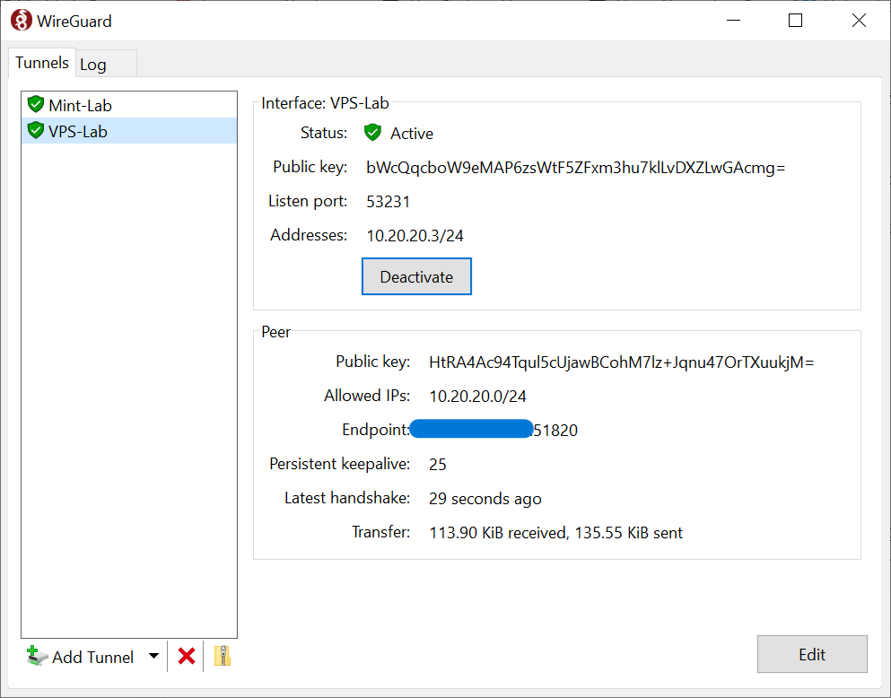
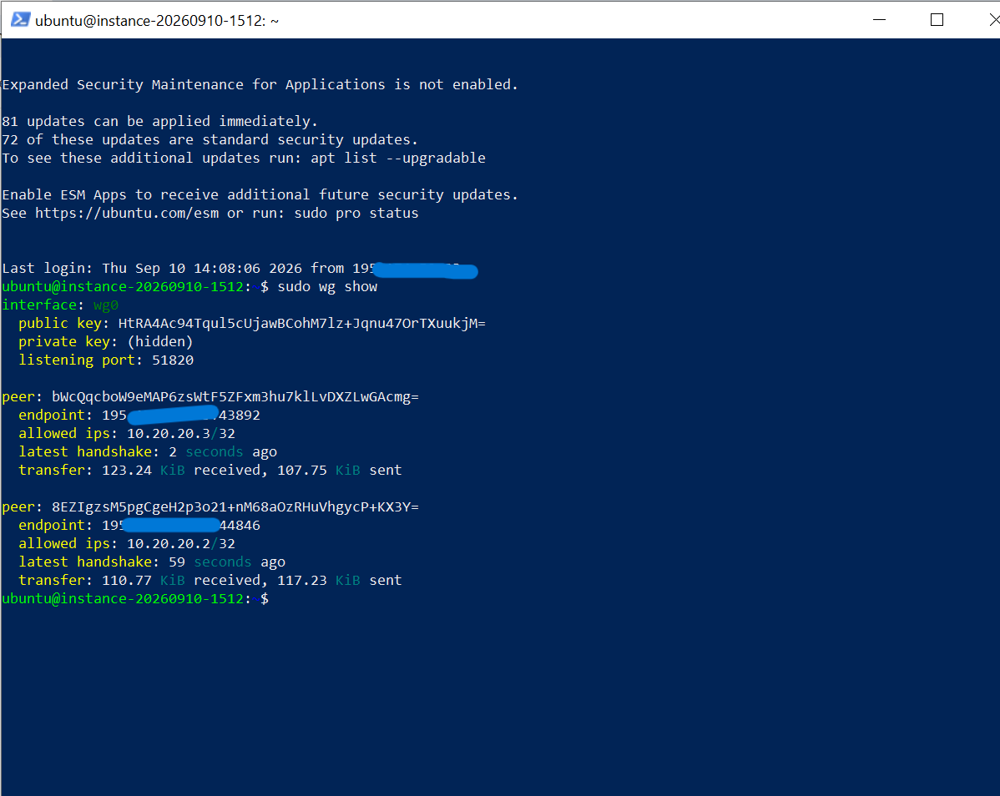
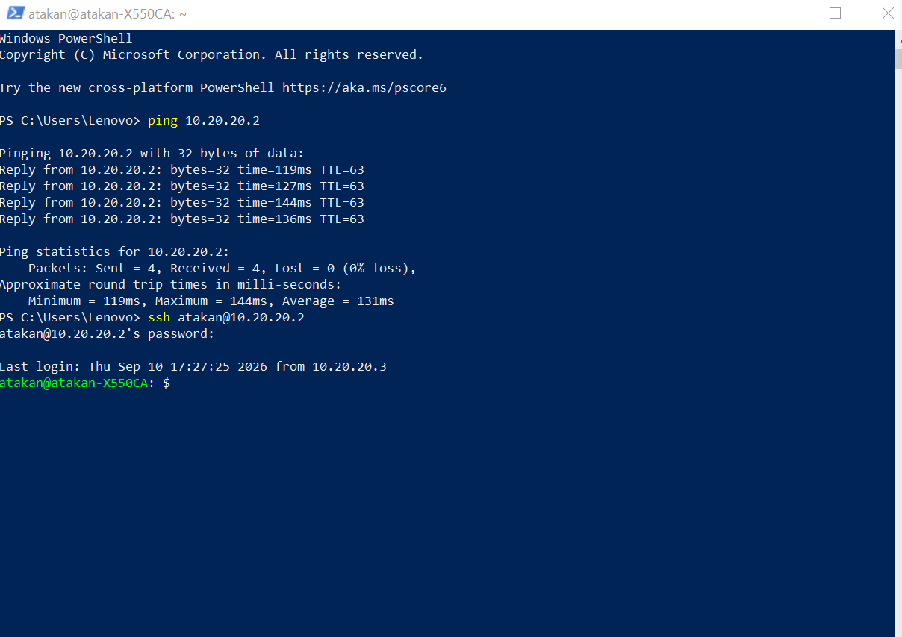

# Remote Access Through CGNAT with WireGuard and a Public VPS

## Goal

The goal of this lab was to reach a Linux Mint laptop remotely over SSH even when the machine was behind CGNAT and could not accept normal inbound connections from the public Internet.

The final design uses a public VPS as a WireGuard hub:

- **VPS:** `10.20.20.1`
- **Linux Mint host:** `10.20.20.2`
- **Windows client:** `10.20.20.3`

The important part of the project was not simply obtaining remote SSH access. The objective was to understand the networking mechanisms involved and build the path manually.

---

## Starting Point — WireGuard on the LAN

The project began with a simpler WireGuard setup between a Windows PC and the Linux Mint laptop on the same local network.

The Mint machine was assigned:

```text
10.10.10.1
```

and the Windows client:

```text
10.10.10.2
```

This worked successfully for both ICMP and SSH:

```powershell
ping 10.10.10.1
ssh atakan@10.10.10.1
```

That proved the basic WireGuard configuration was working correctly.

The next step was to make the same machine reachable from outside the home network.

---

## The Problem — CGNAT

The first assumption was that normal router port forwarding could expose the WireGuard UDP port to the Internet.

That assumption turned out to be wrong.

The router's WAN IPv4 address was inside the `100.64.0.0/10` address range, while the public IPv4 address observed from the Internet was different.

That combination identified the connection as being behind **Carrier-Grade NAT (CGNAT)**.

The path looked roughly like this:

```text
Internet
   |
   v
ISP Public IPv4
   |
   v
ISP CGNAT
   |
   v
Home Router
   |
   v
Linux Mint
```

The home router was not directly holding the public IPv4 address.

Because the upstream NAT belonged to the ISP, configuring port forwarding on the home router would only control the final NAT layer. It could not create a forwarding rule inside the ISP's CGNAT infrastructure.

This meant unsolicited inbound connections from the public Internet could not be forwarded directly to the Mint machine.

---

## Why Port Forwarding Wasn't Enough

Traditional port forwarding assumes that the router receiving the public connection is under the user's control.

Under CGNAT, that is no longer true.

Even if the home router forwards:

```text
UDP 51820 -> Linux Mint
```

the incoming packet must first pass through the ISP's NAT layer.

Without a mapping there, the packet never reaches the home router.

The problem therefore was not WireGuard itself. The problem was reachability.

The solution needed a host with a real public Internet presence that both machines could initiate outbound connections toward.

---

## Why Not Tailscale?

Tailscale could have solved the original remote-access problem much faster.

It handles peer discovery, NAT traversal, CGNAT scenarios, and coordination automatically, while still using WireGuard underneath.

For practical remote access, that abstraction is extremely useful.

However, using Tailscale would also hide many of the networking mechanisms that this lab was intended to explore.

The goal here was not only:

> "How can I SSH into this machine remotely?"

It was also:

> "What has to happen at the networking level for that SSH connection to become possible?"

Building the solution manually required working directly with:

- WireGuard peers and key pairs
- endpoints and peer roaming
- `AllowedIPs`
- CGNAT
- public and private addressing
- UDP traversal
- persistent keepalives
- Linux IP forwarding
- `iptables` INPUT and FORWARD chains
- cloud firewall rules
- routing between VPN peers
- systemd service persistence

Tailscale intentionally abstracts much of this complexity away.

That abstraction is valuable in normal use, but avoiding it here made the network architecture visible and turned a simple remote-access requirement into a much more useful networking lab.

This follows the broader philosophy of `linux-lab`:

> **When the objective is learning, the shortest solution is not always the most valuable one.**

---

## Architecture

A public Ubuntu VPS was introduced as the stable meeting point between the two systems.

Both the Mint machine and the Windows client initiate outbound WireGuard connections to the VPS.

```text
Windows Client
10.20.20.3
      |
      | WireGuard
      v
Public VPS
10.20.20.1
      |
      | WireGuard
      v
Linux Mint
10.20.20.2
      |
      v
SSH
```

The VPS acts as a WireGuard hub and router.

The physical network addresses of the Windows and Mint machines can change. Their overlay addresses remain stable.

This is especially important for the Mint host because it can remain behind NAT or CGNAT while still maintaining an outbound WireGuard connection to the VPS.

---

## Building the VPS Hub

The VPS runs Ubuntu and listens for WireGuard traffic on UDP port `51820`.

The active WireGuard interface uses:

```text
10.20.20.1/24
```

The peer assignments are:

```text
Linux Mint -> 10.20.20.2/32
Windows    -> 10.20.20.3/32
```

A sanitized version of the VPS configuration is:

```ini
[Interface]
Address = 10.20.20.1/24
ListenPort = 51820
PrivateKey = <VPS_PRIVATE_KEY>

[Peer]
PublicKey = <MINT_PUBLIC_KEY>
AllowedIPs = 10.20.20.2/32

[Peer]
PublicKey = <WINDOWS_PUBLIC_KEY>
AllowedIPs = 10.20.20.3/32
```

No fixed peer endpoint is required on the VPS.

The VPS learns the current endpoint of each connecting peer dynamically.

This allows the peers to move between networks without requiring the server configuration to be rewritten.

---

## Linux Mint Peer Configuration

The Mint machine uses a separate WireGuard interface for the VPS connection:

```text
wg-vps
```

Its overlay address is:

```text
10.20.20.2/24
```

A sanitized configuration is:

```ini
[Interface]
Address = 10.20.20.2/24
PrivateKey = <MINT_PRIVATE_KEY>

[Peer]
PublicKey = <VPS_PUBLIC_KEY>
AllowedIPs = 10.20.20.1/32, 10.20.20.3/32
Endpoint = <VPS_PUBLIC_IP>:51820
PersistentKeepalive = 25
```

The Mint host must know the VPS endpoint because it initiates the connection.

`PersistentKeepalive = 25` keeps the UDP NAT mapping alive while the machine is behind NAT or CGNAT.

The Windows overlay address is also included in `AllowedIPs` so that replies for `10.20.20.3` are sent back through the VPS peer.

---

## Windows Peer Configuration

The Windows client uses:

```text
10.20.20.3/24
```

A sanitized version of the configuration is:

```ini
[Interface]
PrivateKey = <WINDOWS_PRIVATE_KEY>
Address = 10.20.20.3/24

[Peer]
PublicKey = <VPS_PUBLIC_KEY>
AllowedIPs = 10.20.20.0/24
Endpoint = <VPS_PUBLIC_IP>:51820
PersistentKeepalive = 25
```

The `10.20.20.0/24` route sends traffic for the WireGuard overlay through the VPS without turning the tunnel into a full Internet VPN.

The client's normal Internet traffic continues to use its normal network connection.



---

## Routing Between Peers

At first, both peers could reach the VPS, but that alone was not enough.

The VPS also needed to forward traffic between them.

Linux IP forwarding was enabled:

```bash
sudo sysctl -w net.ipv4.ip_forward=1
```

and later made persistent with:

```text
net.ipv4.ip_forward=1
```

stored under `/etc/sysctl.d/`.

This allows packets arriving from one WireGuard peer to be routed toward another peer.

Without IP forwarding, the VPS behaves only as an endpoint.

With IP forwarding enabled, it can behave as a router.

---

## Firewall Investigation

One of the most useful troubleshooting steps in the lab happened after the VPS WireGuard configuration appeared correct but no handshake was completing.

The cloud-side security rules already allowed:

```text
UDP 51820
```

However, WireGuard still showed transmitted traffic without receiving anything back.

Instead of changing configuration blindly, packet capture was used on the VPS:

```bash
sudo tcpdump -ni ens3 udp port 51820
```

Incoming UDP packets were visible on the VPS network interface.

That proved several things immediately:

- the Mint host was successfully sending outbound traffic
- CGNAT was not blocking the outbound path
- the VPS public address was reachable
- the cloud security rule was allowing UDP `51820`
- the packet was reaching the VPS operating system

The remaining problem therefore had to be inside the VPS itself.

Inspecting the host firewall showed an INPUT chain ending with a general reject rule:

```text
REJECT all -- 0.0.0.0/0 0.0.0.0/0 reject-with icmp-host-prohibited
```

A WireGuard-specific ACCEPT rule was inserted before it:

```bash
sudo iptables -I INPUT 5 -p udp --dport 51820 -j ACCEPT
```

After that, the WireGuard handshake appeared immediately.

This was an important lesson from the project:

> **Do not guess where the network path is failing. Follow the packet until it disappears.**

---

## Allowing Peer-to-Peer Forwarding

The VPS FORWARD chain also contained a general reject rule.

Traffic between the two WireGuard peers was explicitly allowed before that rule:

```bash
sudo iptables -I FORWARD 1 \
  -i wg0 -o wg0 \
  -s 10.20.20.0/24 \
  -d 10.20.20.0/24 \
  -j ACCEPT
```

This allows packets to enter the VPS through `wg0` and leave through the same WireGuard interface toward another peer.

The rule is intentionally limited to the WireGuard overlay subnet.

---

## Making the Setup Persistent

A working runtime configuration was not considered complete.

Both systems were rebooted to verify that the network could recover without manually recreating interfaces or firewall rules.

### VPS

The VPS WireGuard configuration was saved under:

```text
/etc/wireguard/wg0.conf
```

and enabled through systemd:

```bash
sudo systemctl enable wg-quick@wg0
```

IP forwarding was persisted with a file under:

```text
/etc/sysctl.d/
```

The firewall rules were saved using `iptables-persistent` / `netfilter-persistent`.

After reboot, the VPS automatically restored:

- the `wg0` interface
- WireGuard peer configuration
- UDP `51820` firewall access
- peer-to-peer forwarding
- IPv4 forwarding

### Linux Mint

The Mint WireGuard configuration was saved under:

```text
/etc/wireguard/wg-vps.conf
```

and enabled with:

```bash
sudo systemctl enable wg-quick@wg-vps
```

After reboot, the Mint machine automatically re-established its WireGuard connection to the VPS.

No manual WireGuard commands were required.

---

## Verification on the VPS

The VPS can see both WireGuard peers, each with its own overlay address.

A working state shows recent handshakes and traffic for both peers:



This confirms that both the Windows client and Mint host are connected to the same WireGuard hub.

---

## End-to-End Validation

The final test was performed from Windows.

First, the Mint overlay address was tested:

```powershell
ping 10.20.20.2
```

The result was:

```text
Packets: Sent = 4, Received = 4, Lost = 0 (0% loss)
```

SSH was then opened directly to the same overlay address:

```powershell
ssh atakan@10.20.20.2
```

The connection succeeded.



The important part is that Windows does not need to know the Mint machine's home LAN address or current public endpoint.

The stable target is simply:

```text
10.20.20.2
```

The packet path is:

```text
Windows
   |
   | encrypted WireGuard traffic
   v
Public VPS
   |
   | routed through wg0
   v
Linux Mint
   |
   v
SSH
```

The Mint host can remain behind CGNAT because it establishes the outbound WireGuard connection itself.

---

## Reboot Validation

Persistence was tested on both sides.

The VPS was rebooted first.

After it returned:

```powershell
ping 10.20.20.1
ping 10.20.20.2
ssh atakan@10.20.20.2
```

all succeeded without rebuilding the VPS configuration manually.

The Mint laptop was then rebooted.

After startup, Windows again reached:

```text
10.20.20.2
```

and SSH worked without manually starting WireGuard on the Mint machine.

This confirmed that the final setup was not dependent on temporary runtime state.

---

## Final Result

The completed system provides a stable remote-access path to a Linux machine behind CGNAT:

```text
Windows Client
10.20.20.3
      |
      | WireGuard
      v
Public VPS
10.20.20.1
      |
      | routing
      v
Linux Mint
10.20.20.2
      |
      v
SSH
```

The system does not require:

- a public IPv4 address at home
- inbound port forwarding through the ISP
- a fixed home WAN address
- both machines to be on the same LAN

The public VPS is the stable rendezvous point.

Both peers initiate outbound connections to it, while WireGuard handles encrypted transport and endpoint changes.

---

## What I Learned

This lab started as a simple remote SSH requirement and became a practical exercise in network architecture and troubleshooting.

The most important concepts explored were:

- the difference between LAN and WAN reachability
- why CGNAT breaks normal inbound port forwarding
- how a public VPS can act as a rendezvous point
- WireGuard peer configuration
- the routing role of `AllowedIPs`
- dynamic peer endpoints
- persistent keepalives
- Linux IP forwarding
- the difference between INPUT and FORWARD firewall chains
- cloud firewall rules versus host firewall rules
- packet-level troubleshooting with `tcpdump`
- systemd-based persistence
- validating infrastructure after reboot

The most useful lesson was not a specific command.

It was the troubleshooting process:

```text
Observe the failure
        |
        v
Identify the network layer
        |
        v
Follow the packet
        |
        v
Find where it stops
        |
        v
Change only that layer
        |
        v
Validate again
```

The final SSH connection was useful.

Understanding why it worked was the real result.
