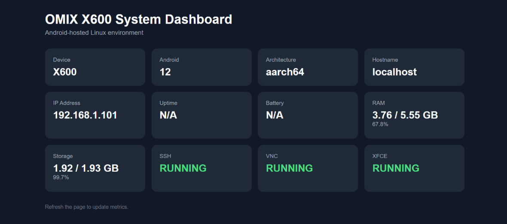

# X600 System Dashboard

A lightweight Flask-based dashboard created to monitor the X600 Linux environment from another device on the local network.

The dashboard was built as part of the X600 Linux experiment to make system state easier to observe while testing SSH, VNC, XFCE, and other services.

## What It Shows

The dashboard currently displays:

- Device model
- Android version
- Architecture
- Hostname
- Local IP address
- System uptime
- Battery status
- RAM usage
- Storage usage
- SSH status
- VNC status
- XFCE session status

## Why It Exists

During the X600 Linux experiments, several services were running simultaneously:

    Termux
    ├── SSH
    ├── Flask dashboard
    ├── TigerVNC
    ├── XFCE
    └── Firefox

Instead of checking each component manually from the terminal, the dashboard provides a simple visual overview of the environment.

It also became useful during debugging sessions, especially when investigating service termination and Android process-management behavior.

## Implementation

The dashboard is written in Python using Flask.

Because `psutil` does not fully support the Android/Termux environment used in this project, system information is collected directly from sources such as:

- `/proc`
- Android system properties (`getprop`)
- sysfs
- shell commands

The application is designed to fail gracefully when a specific system metric is unavailable.

## Screenshot



## Running the Dashboard

From the dashboard directory:

```bash
python app.py
```

The dashboard can then be accessed from another device on the same LAN using:

```text
http://<X600-IP>:5000
```

## Related Investigation

The dashboard was also used while observing process growth and service behavior under heavier workloads.

See:

[Android Process Management Investigation](../docs/06-android-process-management-investigation.md)