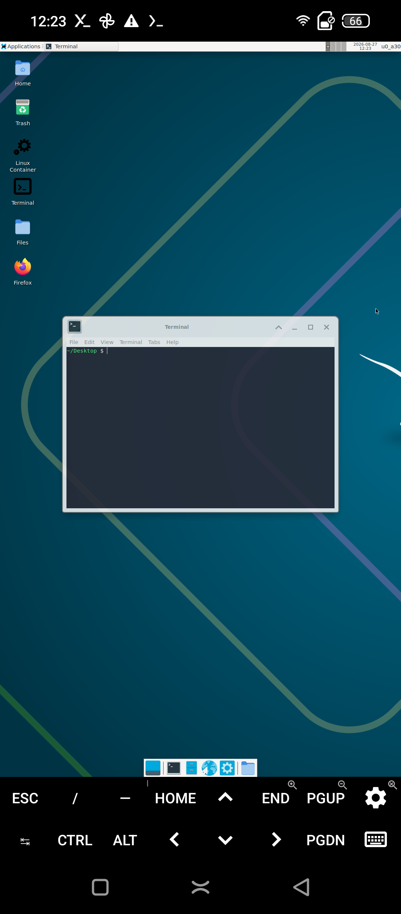

# 03 — Pivot to Android-Hosted Linux

Instead of replacing the Android kernel, the project changed the architecture:

> Keep the kernel that already boots and supports the X600 hardware. Put the Linux userspace and desktop above it.

This was the turning point of the lab.

## Chosen stack

The working stack became:

```text
OMIX X600 hardware
      ↓
Android kernel / vendor drivers
      ↓
Termux userspace
      ↓
XFCE4 desktop
      ↓
Termux:X11 or TigerVNC
```

DroidDesk was used to automate much of the Linux desktop setup.

## Compatibility checks

Before installation, the device was queried with ADB:

```bash
adb shell getprop ro.product.cpu.abi
adb shell getprop ro.build.version.release
adb shell getprop ro.build.version.sdk
adb shell getprop ro.hardware
```

Observed values:

```text
arm64-v8a
12
31
mt6768
```

This satisfied the important ARM64 requirement.

## Installation flow

The software path was:

1. F-Droid
2. Termux
3. Termux:X11
4. DroidDesk setup script
5. XFCE4 as the desktop environment
6. Ubuntu PRoot environment

The DroidDesk installer detected the X600 and selected XFCE4 by default.

Because the device is not Adreno-based, the graphics path fell back away from the ideal Turnip/Adreno acceleration route. This produced warnings around Mesa/GL during startup, but the XFCE desktop still came up successfully.

## First successful desktop

The desktop was started with:

```bash
bash ~/start-x11.sh
```

Termux:X11 then displayed the XFCE session on the phone.

This was the first point where the original goal became visibly real: the phone displayed a conventional Linux desktop with applications, file manager, terminal and Firefox.



*XFCE running directly on the X600 through Termux:X11. The Android interface and Termux:X11 controls remain visible around the Linux desktop.*

## Why the pivot was valuable

The pivot did not erase the native-kernel experiment.

It clarified the system layers:

```text
Native Linux attempt:
replace / deeply modify the platform below userspace

Android-hosted Linux:
reuse the working platform and replace the experience above it
```

Both are useful, but they solve different problems.